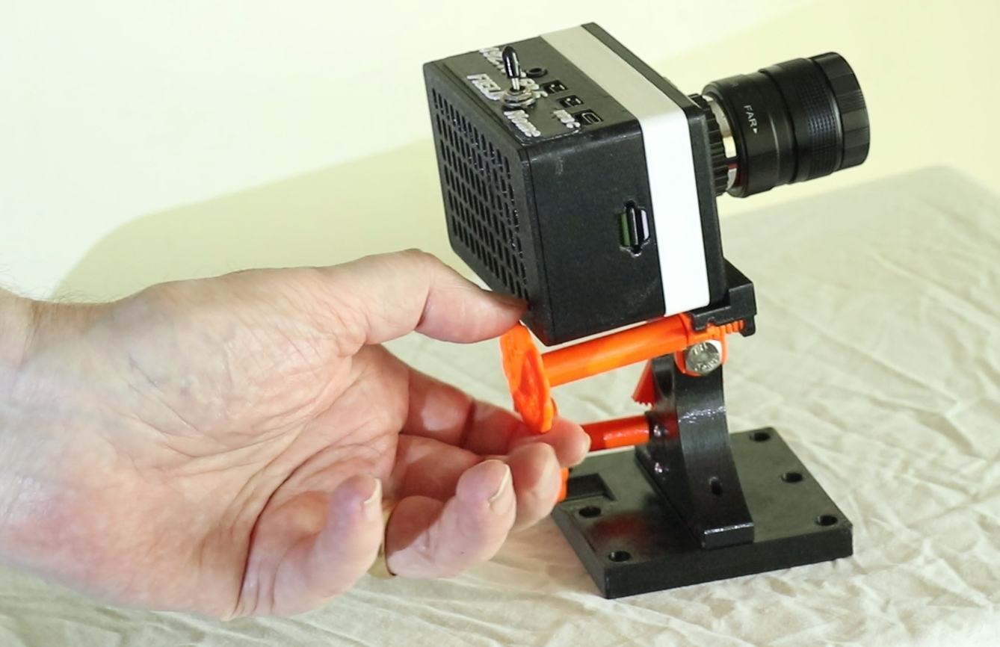
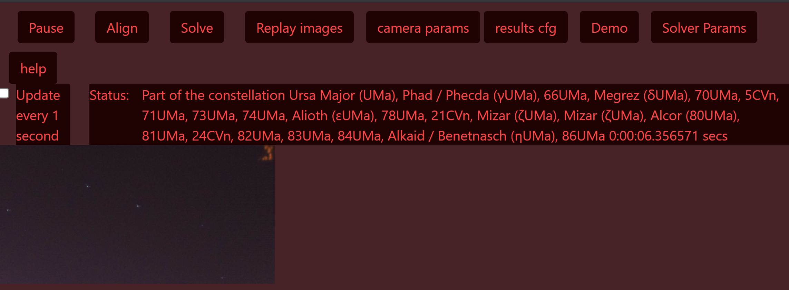
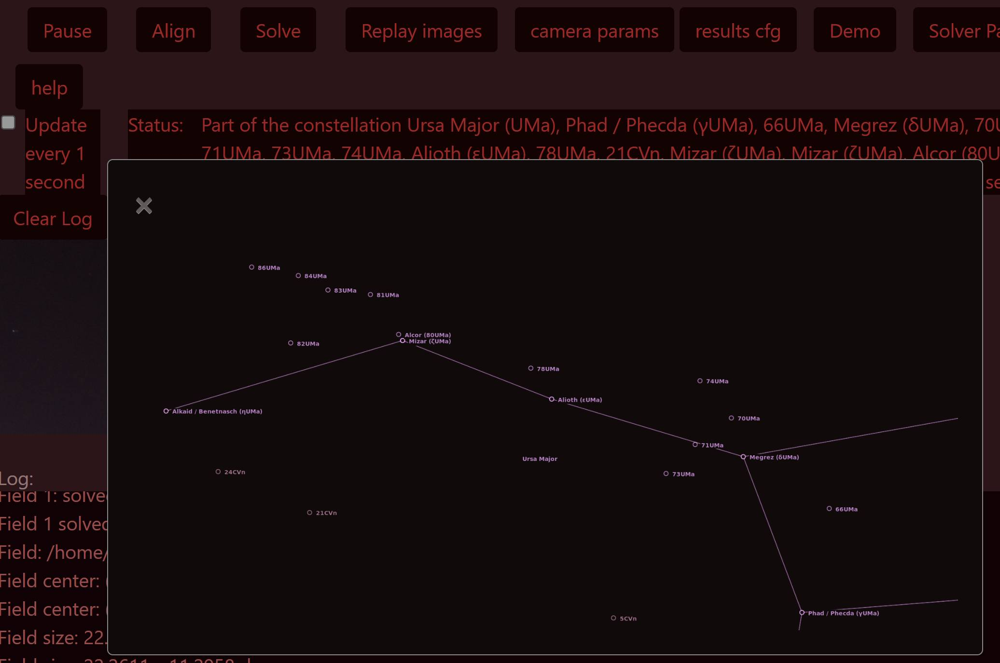

# skysolve

See video for a quick introduction.  https://youtu.be/IewMli4AJLw  
stl files for the case and mount can be found on Thingiverse at https://www.thingiverse.com/thing:4920959 and https://www.thingiverse.com/thing:5594916

Uses RaspberryPi and plate solving to take images of the night sky and identify the location of the image.
 It uses a Raspberry PI 4B (4gb) with the RPI High Quality camera and can send the solved position of were the camera is looking to a computer running SkySafari.  When mounted to a telescope and aligned to where the scope is pointing it can then be used to guide the manual pushing of the telesopce to the desired target without using any encoders on the telescope.  It communicates with SkySafari over WIFI so that no hard wired connections are needed to the computer running SkySafari.  It continually takes images and solves them about every 1 to 10 seconds so that Skysafari can always show where the scope is pointing.
 
Below is a screen shot of the application's browser interface showing an image of Ursa Major in the lower left.  THe status field displays the names of stars it found in the image.
 


This nex image shows a diagram of the constelation found in the image.



### WIFI Connection options

The RPI and the skysolve application can talk to both another computer as a web server and to a computer running SkySafari.  Both need to be on the same WIFI network as the RPI.  When connected the user can control the skysolve application using it's web page accessed by another computer's web browser.

There are two options for the network.   It can be your local WIFI network or the RPI can be the Hot Spot for it's own network that the other computers can connect to,  This is handy for when the Telescope is out of range of your local WIFI.  To begin with the setup process will be done with the RPI connected to your local WIFI.

After setup if the RPI is booted out of range from the WIFI it knows then it will create it's own network that other computers can log into.  This will usually be the case when out on the observing field.  There is also an option to force the RPI to be it's own network (Hot Spot, Access point) even when already connected to the local WIFI.

## Field/Home Switch
	This is optional.   The software on startup will sense the state of this switch.   If in the Field position is will create a WIfII hot spot even if within range of a known WIFI router.   In the Home position it will nuot create the hot spot if it can see the known router but will if it does not see it.
	
	The switch should be connected to the ground GPIO pin and and to GPIO pin 7.  Pin 7 is the 4th pin on the left row of pins when looking at the pi with the USB at the bottom.
	
	If the switch is not attached the default is the home position where it will look for a known WIFI.


There is a setup script meant to automate the many setup steps involved with configuring a Raspberry 4 running Raspbian,
so that it can run this image capture and plate solving astro application I wrote called skysolve. 

## First Usage

After a correct install you can use a Web browser to connect to the skysolve app.  The first thing you will want to do is align the camera to the telescope view.  The application starts in align mode where camera will start taking images and posting them on the web screen. It will not try to solve the image in this mode so that it can loop through taking pictures faster.  You can change camera perameters to adjust exposure and size of image file.   I find that an exposuer of .9 seconds, ISO 800, and a frame size of 800 x 600 are good staring points.  

### Demo Mode

To get a feel how the program works without using it on a telescope you can use the demo mode where it will use several included sky images that can be solved.  Press the Demo button and it will load those images into a list where you can select each one to be solved every time you press the "Solve This" button.  It will also send the solved position to SkySafari if it is connected.  To see the solution press the "results cfg" button then the "show solution" button.  To see what stars it found press the "show stars" button.
If the "show stars button is dimmed out" you can enable it by pressing the "Solver Params" button and the checking the "show found stars" check box.


## Install

When you are ready, you can follow these steps to install it on the Raspberry pi:

>[!NOTE]
>Do not change the default username on the pi from pi to anything else.  There is code that depends upon there being a using named lower case "pi".`

>[!IMPORTANT]
>There are two versions of the code.
>1. ***Legacy*** - Works only on RPI models 4 and earlier and only with 32 bit legacy app.
>2. ***New camera library*** - To work with the newer and 64 bit RPI operating systems and all RPI models.

### Process to use the ***New camera library*** version
1.  First you need to get the Raspberry Pi software installed on an SD card.  The easiest way to do this is to use the RaspberryPi imager
      from [Raspberry Pi org](https://www.raspberrypi.org/software/).  Select the RPI model you have and then select the most recent 64 bit version of the operating system. Usually the first in the list.
      
      Download this software onto a computer that can write SD cards.  I use a Windows laptop.
2. Follow steps 2 thru 5 in the ***Legacy*** version below.

3. Using either you command line connection to the RPI or VNC  Make a direcotry for skysolve then download the skysolve app from GIT Repo to your RPI and Open a Terminal Window.  You could type or copy and paste the following commands into Terminal to accomplish this goal.
```bash
sudo mkdir skysolve
sudo chmod 777 skkysolve
cd skysolve
sudo wget https://github.com/githubdoe/skysolve/archive/newCamLib.tar.gz
sudo tar -xzvf newCamLib.tar.gz --strip-components=1
```
4. Continue at step 7 of the ***Legacy*** instructions.
   

### Process to use the older RPI ***legacy*** system (for new installations use the previous instructions instead.)
1.  First you need to get the Raspberry Pi software installed on an SD card.  The easiest way to do this is to use the RaspberryPi imager
      from [Raspberry Pi org](https://www.raspberrypi.org/software/).  Note that the software to download is not the most recent version but an older 32 bit version.
      It can be found under Raspberry Pi OS (other) then Raspberry Pi OS (Legacy)
      
      Download this software onto a computer that can write SD cards.  I use a Windows laptop.

2. Set the advance menu options in Raspberry pi imager.

     You need to use those advanced options to setup network parameters so that when you boot the pi it will show up on your network and you can talk to it with 	another computer instead of using an external display and keyboard.

     * Set Hostname you want for the PI.   I used SKYPI.
     * Enable SSH and set password
     * Enable "configure WIFI" and Set SSID and password of your local WIFI router you want the pi to connect to during setup.
     * Setup local.  This is important because it is used by the WIFI to select the right frequencies.
     

3.  Burn the image to the SD using the Raspberry Pi imager.

  
4.  Insert the SD Card into the PI after it boots in a minute or so you need to find it on your WIFI network. Your router should have assigned it an
     IP address.  [Here are some ways of finding it.](https://www.raspberrypi.org/documentation/remote-access/ip-address.md)

5. Connecto your computer to the PI. [(See how)](https://www.raspberrypi.org/documentation/remote-access/)
  I use VNC viewer from RealVNC on a windows PC.  So download RealVNC to your PC.  Follow the instructions for connecting to a VNC server like the RPI.
  First we need to enable VNC on the PI.   We will do that from the command line on the RPI.  
  	 On windows machine start a command promt.  Type ssh pi@IPXXX  (Replace IPXxx with either the hostname you set for the pi or by its IP address.)
  	* Enter your password for the PI that you set in step 2.2.
  	* Once logged into the RPI then type sudo raspi-config.
  	* Select 3. Interface Options then P3 VNC and enable it.  Then select yes and then OK.  Now VNC should be enabled.
	* Chose display options and select resolution to be 1280 x 720
	* Optionally enable the Raspberrypi camera now.  From Interface Options select the enable camera option. 
  	* UPDATE: November 2023:
	There is another step needed to be done while still in the raspi-config.  That is to set all localization options to your local.
	
 	Then reboot.
  	Back on the windows PC start the VNC viewer and connect to the IP address of the Raspberry PI.
  


6. Using either you command line connection to the RPI or VNC  Make a direcotry for skysolve then download the skysolve app from GIT Repo to your RPI and Open a Terminal Window.  You could type the following commands into Terminal to accomplish this goal.
```bash
sudo mkdir skysolve
cd skysolve
sudo wget https://github.com/githubdoe/skysolve/archive/main.tar.gz
sudo tar -xzvf main.tar.gz --strip-components=1
``` 
	
	
7.  Run the setup script 
	
    ```
	sudo ./skysolveSetup.sh
    ```
	
    Here is a list of what the script does (If you want to disable or modify any of these, please edit before running the script):


- Uninstalls unattended-upgrades since they can slow down imaging and cause issues with updates.

- Updates/Upgrades the RPI

- Sets the user account to auto-login

- Sets the HDMI to force-hotplug so that it doesn't turn off HDMI when it doesn't immediately detect a display (Helps to solve issues)

- Sets the HDMI group and HDMI mode for a certain display resolution (Please see the comments in the scripts for details and the file /boot/config.txt on the SD card for options.)

- Disables the screen lock and screen saver to prevent them from causing issues when connecting via VNC

- Disables the CUPS modules for parallel printers since none are attached and it slows down boot (Raspberry Pi script only)


- Makes a folder called utilties on the Desktop

- Creates a shortcut/launcher for the UDev Script in utilities on the Desktop


- Creates a hotspot Wifi profile for the observing field


- Installs Astrometry.net and the Index Files

- Sets up samba and caja filesharing so you can share any folder by right clicking

8.  After the script finishes type sudo reboot to complete the setup.
## Testing the install
When the RPI reboots it should be running the skysolve application. 
### Testing skysolve
	On any PC or tablet on the same network as the RPI start up an internet browser and enter the address of the RPI followed by :5000.
	for example 192.168.1.170:5000 for an RPI at IP address of 192.168.1.170.
### Testing SkySafari connection
    * On your device running Skysafari start SkySafari and setup the Telescope control to use the IP address of the RPI and to use port 5005.
    * Try to connect to the Telescope.   If it connects then the RPI is running and will give a default position set by the setup.
    * Set the telescope type to StellarCat ServoCat and mount type to ALT=AZ. Push-TO.  Set the Connect Via WIFI and do not select Auto-Detect SkyFi.

10.  Setup the PI camera and plate solving parameters.
    1. On a pc or tablet on the same network as the pi using a network browser like Chrome connect to <RPI IP>:5000  where <RPI IP> is the ip address of the Raspberry pi.
    This should bring up the skysolve web page.  Click on the help button on that page for info how to setup the camera and solve parameters.

